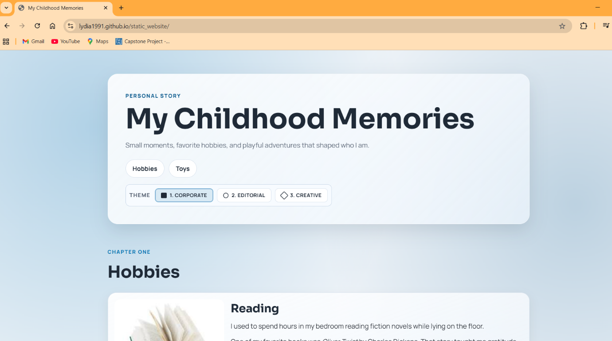

# My Childhood Static Website

A polished static website built with HTML, CSS, and a small amount of JavaScript to showcase childhood memories in a more modern, professional layout.

## Live Site

https://lydia1991.github.io/static_website/

## Screenshot

## Files

- index.html
- style.css
- screenshot.png
- static_url.txt

## Features

- Responsive one-page layout
- Three switchable visual themes: Corporate, Editorial, and Creative
- Hero section, story cards, and polished styling
- Hosted with GitHub Pages
